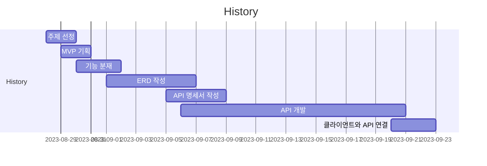

# Codevelop Backend

> **멘토**와 **멘티**를 매칭하여 **코드리뷰** 서비스가 이루어지는 **C2C 플랫폼**
> 2023.08.28 ~ 2023.09.22 (25일)

 

# Team

|**디자이너**|**프론트엔드**|**백엔드**|
|---|---|---|
|허세광|심채운|황민혁|
||김지우|서주원|
||하진수|오명재|
||조하윤|홍종민|
||모유빈|김정렬|

 

# Links

| 구분 | URL |
| --- | --- |
| 발표 노션 | https://www.notion.so/Codevelop-2e07fa5f06894653aec83b1ad8723d09?pvs=21 |

 

# History

 

# Skill Stacks

[Skill Stacks](https://www.notion.so/cfe762e2f47341278be54e305d78366f?pvs=21)

# ERD

# APIs

[APIs](https://www.notion.so/c76e9fca3d934ac6ac3aecc0fd7a6490?pvs=21)

# Frontend Features

[FrontendFeatures](https://www.notion.so/e6ef7a50a83544289efe3900e9c706a0?pvs=21)

# Backend Features

[Backend Features](https://www.notion.so/68be6f4e8d0b43109a30f9cdecf7b245?pvs=21)

# Impressions

[프론트엔드 소감](https://www.notion.so/4085f385f50d45d78df702d418bec3e9?pvs=21)

[백엔드 소감](https://www.notion.so/093de52256c44030926b6ed53017fe69?pvs=21)
