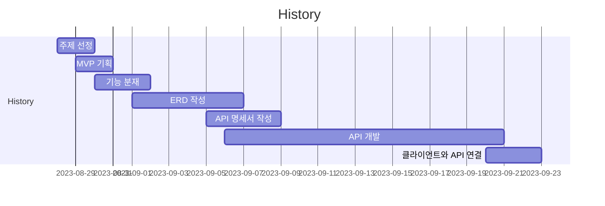

# Codevelop Backend

> **멘토**와 **멘티**를 매칭하여 **코드리뷰** 서비스가 이루어지는 **C2C 플랫폼**
> 2023.08.28 ~ 2023.09.22 (25일)

 

# Team

|**디자이너**|**프론트엔드**|**백엔드**|
|---|---|---|
|허세광|심채운|황민혁|
||김지우|서주원|
||하진수|오명재|
||조하윤|홍종민|
||모유빈|김정렬|

 

# Links

| 구분 | URL |
| --- | --- |
| 발표 노션 | https://www.notion.so/Codevelop-2e07fa5f06894653aec83b1ad8723d09?pvs=21 |

 

# History

 

# Skill Stacks

- Java 11
- Spring Boot
- Spring Security
- JPA(Hibernate)
- MySQL
- Querydsl
- Git/GitHub
- GitHub Action
- Spring Batch
- AWS EC2
- AWS RDS
- AWS S3
- Docker
- Swagger
- Webhook
- WebRTC
- Notion

 

# ERD

 

# Backend Features

| 황민혁 | 김정렬 | 서주원 | 오명재 | 홍종민 |
| --- | --- | --- | --- | --- |
| 결제 및 예약 | 화상 회의/화면 공유 | 멘토 검색 및 필터링 | Webhook을 이용한 모니터링 적용 | 채팅 |
| 로그인/로그아웃, JWT 토큰 인증 |  | 리뷰 조회, 등록, 삭제 | Git Action CI/CD |  |
| 다중 이미지 업로드 |  | 인기 기술 스택 조회 | 포스트 검색 및 필터링 |  |
| 멘티 <-> 멘토 전환 |  | 검색 기록 BatchProcessing | 포스트 조회, 등록, 수정, 삭제 |  |
| 회원 정보 수정 및 조회 |  | 인기 기술 스택 Batch Statistics | 코드리뷰 날짜 조회 및 결제 신청 |  |
| 페이머니 충전 및 조회 |  | 별점 업데이트 Batch Statistic |  |  |

 

# Impressions

> ## 황민혁
